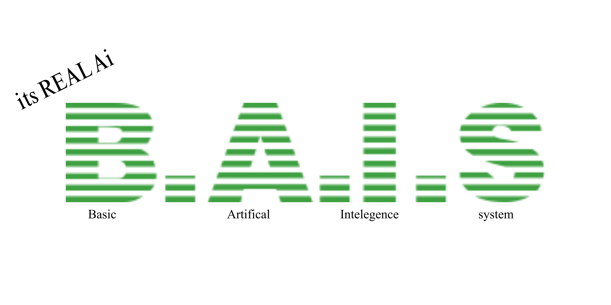

  

# B.A.I.S

BAIS is a simple python based AI model system made by using chatgpt and using torch, The Ai currentlly is in very Early Development and is Very unstable. 

****BAIS IS IN BETA BUILDS AND IS VERY BROKEN****

## how BAIS works
BAIS works by using the BAIS_builder program to create and train the ai model using the contents in data.txt file. #WARNING THE AI CREATION PROCESS CAN TAKE A LOT OF CPU AND GPU MEMORY# after that it should create a .pth file which is that ai model you can use in teh BAIS program

## Future of BAIS
Hopefully in the future BAIS will finally get smart enought o accually communicate with people
